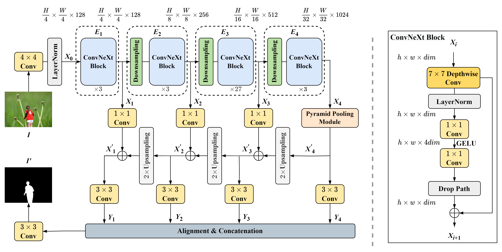

## Effective Image Tampering Localization with Multi-Scale ConvNeXt Feature Fusion  
[](https://arxiv.org/abs/2208.13739)

Official PyTorch implementation of the ConvNeXtFF model proposed in the paper "Haochen Zhu, Gang Cao, Mo Zhao. Effective Image Tampering Localization with Multi-Scale ConvNeXt Feature Fusion, arXiv 2022".
### Network Architecture
<center>  </center>

### Prerequisites
See ./requirements.txt
And refer to [official MMSegmentation documentation](https://mmsegmentation.readthedocs.io/en/latest/).

### Training
Prepare for the training dataset like VOCdevkit and move it into `./data/`.
The pre-trained model can be downloaded as following:[pre-trained model for backbone](https://pan.baidu.com/s/1CWkdVMwPmgQnKVQZNM1f9g), code `0yh3`.
```python
python train.py
```

### Testing

Download the [weights](https://pan.baidu.com/s/1AI2KQJmBdEeGtPGZGyNkWQ)(code `jjyl`) and move it into the `./checkpoints/`.
To run all images in "samples/" directory, run:
```
python test.py
```

## Bibtex
 ```
@inproceedings{Zhu2022EffectiveIT,
  title={Effective Image Tampering Localization with Multi-Scale ConvNeXt Feature Fusion},
  author={Haochen Zhu, Gang Cao, Mo Zhao},
  year={2022},
  url={https://arxiv.org/abs/2208.13739}
}
```
### Contact

If you have any questions, please contact me(zhuhc_98@163.com).
